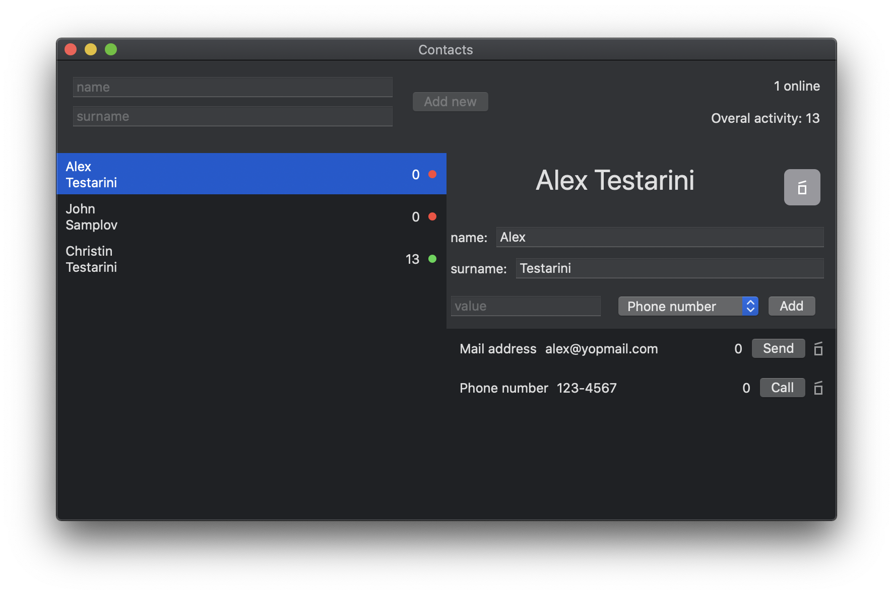
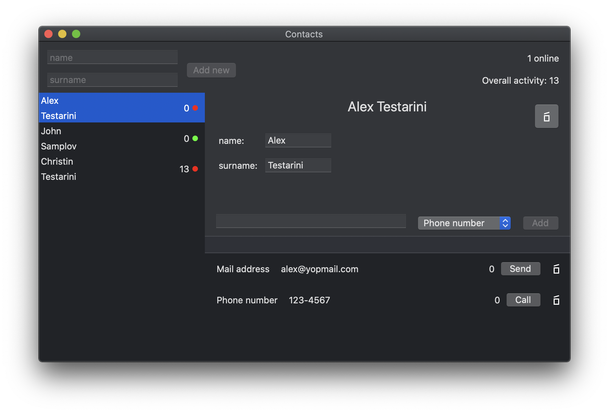

# macRosetta

Rosetta stone of mac development.

## SwiftUI
Project name - "PostmodernTech"



## Cocoa (obj-c runtime)
Project name - "AncientMagic"



## Cocoa (delegates)
Project name - "MuggleTech"


## SwiftRX
Project name - "WeirdMagic"


 
## Requirements to Build the Project

1. Pull this repository.
2. Change Apple ID account in Signing&Capabilities;
3. Specific macOS and Xcode versions (see macRoseta.xcodeproj, Xcode 12.4, and MacOS 10.15.7 for now).

# Development Process

## Git Branching Model

[Git-flow](http://nvie.com/posts/a-successful-git-branching-model/)


## Coding Style

* [Google Coding Standard](https://google.github.io/swift)
* [Swift Lint](https://github.com/realm/SwiftLint/blob/master/Rules.md)


## Versioning

Every version number is described as:
```
x.y.z
```
Where:
* x – major version;
* y – minor version;
* z – bugfix version.
